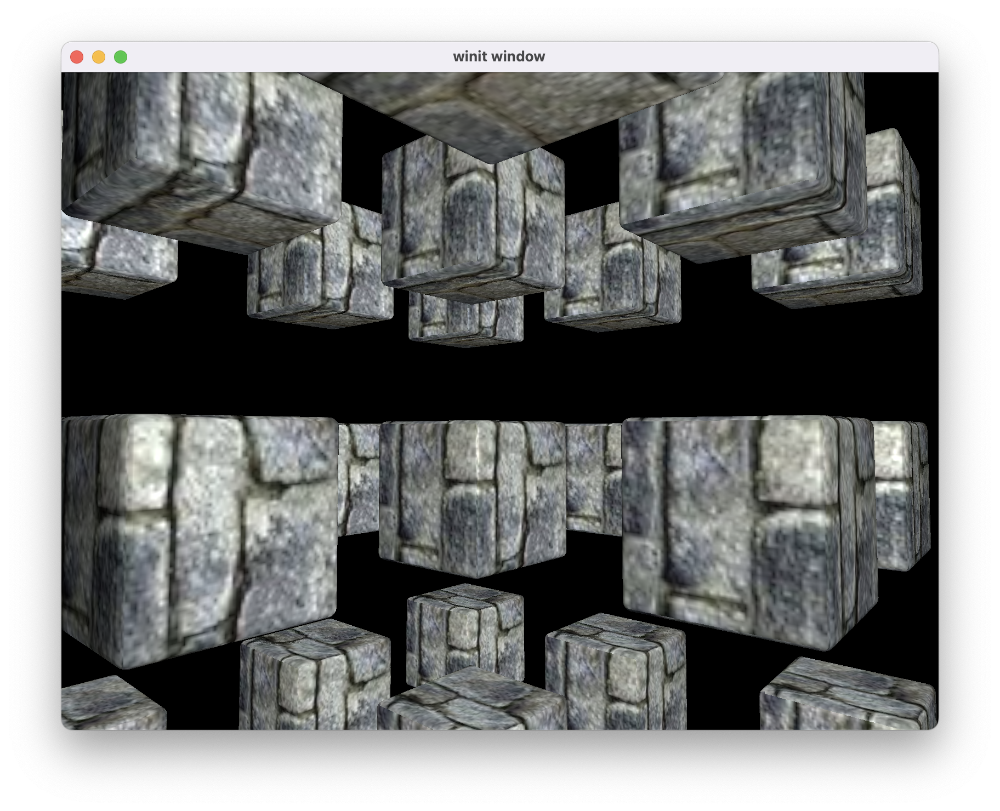

# Basic 3D Game Engine

This is a basic 3D game engine written in Rust, using the wgpu graphics library. This project is my first venture into graphics programming, so I would not call any of this 'good code'.   

## Features
- 3D rendering
- Basic Entity-Component-System
  - every 'thing' in the world is an Entity
  - each Entity has any number of Component; each Component can store data
  - behaviour of entities is controlled through Systems, which are function which are executed every game tick, and can modify Component data
- Camera and Camera controller system
- Real Time Lighting  
- Mechanism for having multiple Renderers

## Status
As this is my first big graphics programming project, the codebase is an absolute mess. As such, I have decided to put this engine on indefinite hiatus and to start a new one with everything I have learnt from this one.
